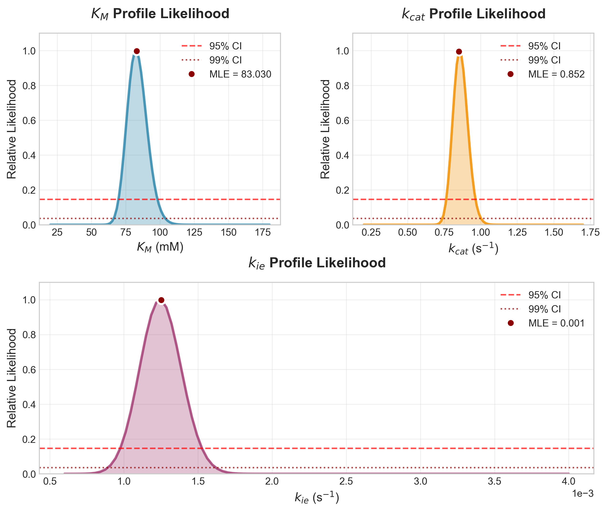

# Profile Likelihood Analysis of the reaction of ABTS with SLAC

Within this folder, we supply the source code for the profile likelihood analysis of the reaction of ABTS with SLAC using EnzymeML-RS detailed in the publication *Range, J. et al. (2025)*. This analysis provides confidence intervals and uncertainty quantification for the fitted kinetic parameters ($K_M$, $k_{cat}$, and $k_{ie}$) from the EnzymeML document.

The folder contains the following files:

- `run.sh`: The script to generate profile likelihood curves for all three kinetic parameters using EnzymeML-RS.
- `visualize.py`: The Python script to create publication-ready visualizations of the profile likelihood results.
- `Km/`: The folder containing the profile likelihood results for the $K_M$ parameter.
  - `SLAC_kinetic_assay_concentration_profile.tsv`: The profile likelihood data for $K_M$.
- `k_cat/`: The folder containing the profile likelihood results for the $k_{cat}$ parameter.
  - `SLAC_kinetic_assay_concentration_profile.tsv`: The profile likelihood data for $k_{cat}$.
- `k_ie/`: The folder containing the profile likelihood results for the $k_{ie}$ parameter.
  - `SLAC_kinetic_assay_concentration_profile.tsv`: The profile likelihood data for $k_{ie}$.
- `profile_likelihood_analysis.png`: The generated visualization showing all three profile likelihood curves.

## Workflow

### 1. Generate Profile Likelihood Curves

The `run.sh` script uses the EnzymeML-RS CLI to generate profile likelihood curves for each kinetic parameter. The script:

- Sets parameter bounds for profiling: $K_M$ (20.0-180.0 mM), $k_{cat}$ (0.2-1.7 s⁻¹), and $k_{ie}$ (0.0006-0.004 s⁻¹)
- Configures the profiling with 100 steps for each parameter
- Uses the SR1 optimizer with RK4 solver and log-transform for robust fitting
- Generates separate profile likelihood curves for each parameter in their respective output directories

To run the profile likelihood analysis:

First, install EnzymeML-RS (Suite) using the following command :

```bash
cargo install enzymeml
```

Then, run the script to generate the profile likelihood curves:

```bash
./run.sh
```

### 2. Visualize the Results

The `visualize.py` script creates a publication-ready visualization of the profile likelihood results. The figure shows the profile likelihood curves for each kinetic parameter, with the maximum likelihood point and confidence intervals highlighted.

## Results

The profile liekelihood yields the following results:



The profile-likelihood curves are sharply peaked for all three kinetic parameters, indicating that the data constrain them well.

- $K_M$ reaches its maximum at ≈ 83 mM, with the 95 % likelihood support roughly spanning 73–94 mM and the 99 % support extending only a little wider.
- $k_{cat}$ is centred at ≈ 0.85 s⁻¹; its 95 % interval is narrow (≈ 0.78–0.93 s⁻¹), showing high precision.
- $k_{ie}$ peaks near 1 × 10⁻³ s⁻¹; even at the 99 % threshold the interval remains tight (≈ 0.9–1.6 × 10⁻³ s⁻¹).

Overall, each parameter’s maximum-likelihood estimate is well defined and accompanied by small confidence bands, confirming that the model is identifiable with the available data.